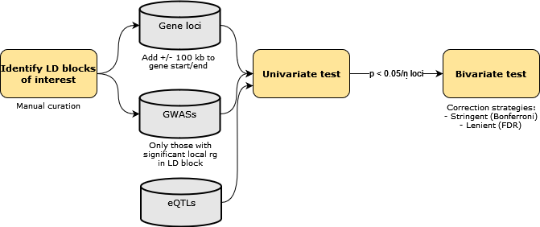

```{r setup, include = FALSE}

library(circlize) # For chord diagram
library(ggplot2) # For plotting
library(ggraph) # For edge diagrams
library(tidyverse) # For tidy manipulation of data
library(stringr) # For string manipulation
library(rtracklayer) # For loading of reference gtf

knitr::opts_chunk$set(echo = T, warning = F, message = F)

# Set defaults for ggplots 
theme_rhr <- theme_set(
  theme_bw(base_family = "Helvetica",
           base_size = 10) + 
  theme(panel.grid.major.x = element_blank(),
        legend.position = "top",
        axis.text.x = element_text(angle = 90, hjust = 1, vjust = 0.5),
        axis.title.y = element_text(vjust = 0.6),
        panel.spacing = unit(0.1, "lines"))
)

fct_disease <- c("AD", "LBD", "PD", "BIP", "MDD", "SCZ")
gene_filtered_loci <- 
  readRDS(
    here::here("results", "04_eqtl_univar_bivar", "gene_filtered_loci.rds")
  )
```

> Aim: run univariate and bivariate analyses using eQTL data for select loci

<br><br>

# Background

Bivariate local $r_{g}$ analyses revealed several loci (representing LD blocks) where significant $r_{g}$'s were found between multiple trait pairs. Of note, some LD blocks contained local $r_{g}$'s between neurodegenerative traits and between neuropscyhiatric traits, but with no overlap between the disorder groups. In addition, we observed LD blocks where several traits were associated with one trait in particular, but directions of effect were opposing (e.g. locus 1719, where BIP and MDD were positively correlated with SCZ, while LBD was negatively correlated with SCZ; or locus 2351, where AD and PD were positively and negatively correlated with LBD, respectively). Assuming that these assocations also correlate with expression quantitative trait loci (eQTLs), such differences may be driven by associations to different gene eQTLs.

# Supplementary code {.tabset}

Following section includes any intermediary code used in this `.Rmd`.

## Get gene loci 

```{r find-overlaps, eval = F}

source(here::here("scripts", "04a_get_gene_loci.R"))

```

All gene loci are shown below. 

```{r ld-blocks-table}

gene_loci <- 
  read_delim(
    file = here::here("results", "04_eqtl_univar_bivar", "gene_filtered.loci"),
    delim = "\t"
    )

gene_loci %>% 
  DT::datatable(rownames = FALSE,
                options = list(scrollX = TRUE),
                class = 'white-space: nowrap')

```

## Pre-processing eQTL data

```{r preprocess-eqtl, eval = F}

source(here::here("scripts", "04b_preprocess_eqtl.R"))

```

## Get sample overlap 

```{r get-sample-overlaps, eval = F}

source(here::here("scripts", "04c_get_sample_overlaps.R"))

```

Subset of sample overlap matrix shown below.

```{r load-sample-overlap}

sample_overlap <-
  read.table(
    file = here::here("results", "04_eqtl_univar_bivar", "sample_overlap.txt")
    )

as.matrix(sample_overlap)[1:10,1:10]

```

## Prepare input info file

```{r get-input-info, eval = F}

# Most input info already available, just need to add eqtls
input_info  <- 
  read_delim(
    file = file.path(here::here("results", "01_input_prep"),
                     "input.info.txt"),
    delim = "\t"
  )

file_paths <- 
  list.files(
      path = here::here("results", "04_eqtl_univar_bivar", "qtl_files"),
      pattern = "lava.gz",
      full.names = T
    )

input_info <-
  tibble(
    phenotype = 
      basename(file_paths) %>% 
      str_remove(".lava.gz"),
    cases = rep(1, times = length(file_paths)),
    controls = rep(0, times = length(file_paths)),
    filename = file_paths
  ) %>% 
  dplyr::bind_rows(
    input_info
  )

write_delim(
  input_info,
  path = file.path(here::here("results", "04_eqtl_univar_bivar"),
                   "input.info.txt"),
  delim = "\t"
)

```

## Run univariate and bivariate tests
This was run using `nohup`:

```{bash bash-run-univar-bivar, eval = F}
# Have to navigate to root project folder for script to work (as it uses here package)
cd /home/rreynolds/misc_projects/neurodegen-psych-local-corr

nohup Rscript \
/home/rreynolds/misc_projects/neurodegen-psych-local-corr/scripts/04d_run_univar_bivar_test.R \
&>/home/rreynolds/misc_projects/neurodegen-psych-local-corr/logs/04d_run_univar_bivar_test.log&

```

## Loading results
Once run, results can be loaded using the following code chunk:

```{r load-lava-results}

results <- 
  setNames(
    vector(mode = "list", length = 2),
    nm = c("univ", "bivar")
  )

for(i in 1:length(results)){
  
  results[[i]] <- 
    setNames(
      object = 
        list.files(
          path = 
            here::here("results",
                       "04_eqtl_univar_bivar",
                       names(results)[i]),
          pattern = ".lava.rds", 
          full.names = T
        ) %>% 
        lapply(., function(file) readRDS(file)),
      nm = 
        list.files(
          path = 
            here::here("results",
                       "04_eqtl_univar_bivar",
                       names(results)[i]),
          pattern = ".lava.rds"
        ) %>% 
        str_remove(., "\\..*.lava.rds")
    ) %>% 
    purrr::discard(is.null) %>% 
    qdapTools::list_df2df(col1 = "eqtl_gene") %>% 
    dplyr::rename(
      gene_locus = locus
    ) %>% 
    tidyr::separate(
      col = eqtl_gene,
      into = c("eqtl_dataset", NA),
      sep = ":"
    ) %>% 
    dplyr::inner_join(
      gene_filtered_loci %>% 
        dplyr::select(
          ld_block = locus, gene_id, gene_name
        ),
      by = c("gene_locus" = "gene_id")
    ) %>% 
    dplyr::select(
      ld_block, eqtl_dataset, gene_locus, gene_name, everything()
    ) %>% 
    dplyr::arrange(ld_block, gene_locus, eqtl_dataset)
  
}

```

## Loading plotting functions

```{r load-plot-func}

source(here::here("R", "plots.R"))

```

# Methods {.tabset}



## Deriving loci for eQTL analyses

Firstly, we determined a number of LD blocks of interest from the LD blocks highlighted by bivariate local $r_{g}$ analyses. LD blocks included:

- Two LD blocks where AD and PD were correlated, but the correlation was either positive or negative.
    - Locus 681, containing *SNCA*, which is of interest to PD
    - Locus 1273, containing *CLU*, which is of interest to AD
- An LD block where correlations were observed among neurodegenerative traits and among neuropsychiatric traits, but not between disorder groups, i.e. locus 2281, containing *RAB27B*
- Two LD blocks where several traits were associated with one trait in particular, but directions of effect were opposing.
    - Locus 1719, containing *DRD2*
    - Locus 2351, containing *APOE*

From these LD blocks of interest, we defined gene loci. That is, a 100 kb window was added to the start and end of any gene that overlapped a locus of interest. These gene-defined loci were carried forward in downstream analyses.   

## Sample overlap
Due to the potential sample overlap between cohorts and its impact on any estimated correlations, it is advised to use cross-trait LDSC ([PMID:25642630](https://pubmed.ncbi.nlm.nih.gov/25642630/); [PMID:26414676](https://pubmed.ncbi.nlm.nih.gov/26414676/)) to obtain an estimate of the sample overlap. This, however, is not possible with eQTL summary statistics. Provided a reasonable certainty that there is no sample overlap between eQTL and GWAS summary statistics, it can be assumed to be zero (which precludes any correlations between eQTLGen and PsychENCODE, as both use GTEx samples, albeit from different tissues). **This, however, needs double-checking in terms of eQTL and GWAS cohorts.** 

## Running univariate and bivariate tests using eQTL summary statistics
For each gene locus, only those traits that were found to have significant local $r_{g}$ in the associated LD block were used for univariate and bivariate analyses with eQTL summary statistics. As described in [02_run_univar_bivar_test.html](02_run_univar_bivar_test.html), a univariate test was performed as a filtering step for bivariate local $r_{g}$ analyses. Bivariate local correlations were only performed (i) if the eQTL within the gene locus exhibited a significant univariate local genetic signal and (ii) for pairs of traits which both exhibited a significant univariate local genetic signal. A liberal cut-off of p < 0.05 was used to determine univariate significance on account of this being an exploratory, follow-up analysis of previously identified regions of local $r_{g}$). This resulted in a total of **`r nrow(results$bivar)`** bivariate tests spanning **`r results$bivar %>% .[["gene_locus"]] %>% unique() %>% length()`** distinct gene loci. P-values were FDR-corrected, correcting for the number of bivariate tests within an LD block.                

# Results {.tabset}

## Tabular results {.tabset}

### Univariate results
```{r univar-table}
print("Univariate column descriptions:")

tibble(
  column = colnames(results$univ),
  description = 
    c(
      "LD block",
      "eQTL dataset used",
      "Gene locus as identified by ensembl ID",
      "Gene name",
      "Gene locus chromosome",
      "Gene locus start base pair",
      "Gene locus end base pair",
      "The number of SNPs within the locus",
      "The number of PCs retained within the locus",
      "Analysed phenotype",
      "Observed local heritability",
      "P-value from the univariate test (F-test for continuous, Chi-sq for binary)"
    )
) %>%
  DT::datatable(rownames = FALSE,
                options = list(scrollX = TRUE),
                class = 'white-space: nowrap')

print("Univariate results (p < 0.05):")

results$univ <- 
  results$univ %>% 
  dplyr::mutate(
    phen = 
      case_when(
        !str_detect(phen, "ENSG") ~ phen %>% 
          str_replace_all("[:digit:]", "") %>% 
          str_remove("\\..*"),
        str_detect(phen, "ENSG") ~ str_remove(phen, ".*_")
      )
  )

results$univ %>% 
  dplyr::filter(p < 0.05) %>%
  DT::datatable(rownames = FALSE,
                options = list(scrollX = TRUE),
                class = 'white-space: nowrap')
```

### Bivariate results

- Multiple test correction is complicated by the many overlapping gene loci and the fact that we're repeatedly testing the same disease phenotypes within one LD block (and simply substituting the eQTL-gene)
- Thus, FDR correction applied within an LD block (i.e. only correcting for the number of bivariate tests within each LD block).

```{r bivar-table}

results$bivar <-
  results$bivar %>% 
  dplyr::mutate(
    across(
      .cols = contains("phen"),
      ~ case_when(
        !str_detect(.x, "ENSG") ~ .x %>% 
          str_replace_all("[:digit:]", "") %>% 
          str_remove("\\..*"),
        str_detect(.x, "ENSG") ~ str_remove(.x, ".*_")
      )
    )
  ) %>% 
  dplyr::group_by(ld_block) %>% 
  dplyr::mutate(
    fdr = p.adjust(p, method = "fdr")
  )

print("Bivariate column descriptions:")

tibble(
  column = colnames(results$bivar),
  description = 
    c(
      "LD block",
      "eQTL dataset used",
      "Gene locus as identified by ensembl ID",
      "Gene name",
      "Gene locus chromosome",
      "Gene locus start base pair",
      "Gene locus end base pair",
      "The number of SNPs within the locus",
      "The number of PCs retained within the locus",
      "Phenotype 1",
      "Phenotype 2",
      "Standardised coefficient for the local genetic correlation",
      "Lower 95% confidence estimate for rho",
      "Upper 95% confidence estimate for rho",
      "Equivalent of taking the square of rho. Denotes the proportion of variance in genetic signal for phen1 explained by phen2 (and vice versa)",
      "Lower 95% confidence estimate for r2",
      "Upper 95% confidence estimate for r2",
      "Simulation p-values for the local genetic correlation",
      "FDR-corrected p-values. FDR correction applied within an LD block (i.e. only correcting for the number of bivariate tests within each LD block)"
    )
) %>%
  DT::datatable(rownames = FALSE,
                options = list(scrollX = TRUE),
                class = 'white-space: wrap')

print("Bivariate results (fdr < 0.05):")

bivar_sign <-
  results$bivar %>% 
  dplyr::filter(fdr < 0.05)

bivar_sign %>% 
  DT::datatable(rownames = FALSE,
                options = list(scrollX = TRUE),
                class = 'white-space: nowrap')


```

## Significant bivariate local $r_{g}$'s at a global level  {.tabset}

### Text

- We detect a total of `r bivar_sign %>% nrow()` significant bivariate local $r_{g}$'s across `r bivar_sign %>% dplyr::distinct(gene_locus) %>% nrow()` distinct gene loci. When pairs of disease phenotypes (which were tested across multiple genes within an LD block) are collapsed within an LD block, we detect a total of `r bivar_sign %>% dplyr::distinct(ld_block, phen1, phen2) %>% nrow()` significant bivariate local $r_{g}$'s.
- Of the two eQTL datasets, the dataset with the highest number of gene loci (i.e. a gene where eQTLs were detected) was PsychENCODE (eQTLGen, n gene loci = `r results$univ %>% dplyr::distinct(eqtl_dataset, gene_locus) %>% dplyr::count(eqtl_dataset) %>% dplyr::filter(eqtl_dataset == "EQTLGEN") %>% .[["n"]]`; PsychENCODE, n gene loci = `r results$univ %>% dplyr::distinct(eqtl_dataset, gene_locus) %>% dplyr::count(eqtl_dataset) %>% dplyr::filter(eqtl_dataset == "PSYCHENCODE") %>% .[["n"]]`). In spite of this, the eQTL dataset with highest number of significant bivariate local $r_{g}$'s was eQTLGen (Figure \@ref(fig:chord-diagram-rho)).
- Given that gene loci might vary in size, we plotted the number of SNPs within a locus and the p-value from the univariate test to determine. There was no apparent relationship between the two (as determined by visual inspection, Figure \@ref(fig:nsnps-univ-pvalue)).

### Figures

```{r chord-diagram-rho, fig.height = 6, fig.cap = "Chord diagram showing the number of **distinct** significant bivariate local genetic correlations between each of the traits across all LD blocks. Pairs of disease phenotypes (which were tested across multiple genes within an LD block) were collapsed and their average rho within the LD block used. Positive and negative correlations are coloured red and blue, respectively."}

data_to_plot <-
  bivar_sign %>% 
  dplyr::filter(!str_detect(phen2, "ENSG")) %>% 
  dplyr::distinct(ld_block, phen1, phen2, rho) %>% 
  dplyr::group_by(ld_block, phen1, phen2) %>% 
  dplyr::summarise(rho = mean(rho)) %>% 
  dplyr::bind_rows(
    bivar_sign %>% 
      dplyr::filter(str_detect(phen2, "ENSG")) %>% 
      dplyr::distinct(eqtl_dataset, ld_block, phen1, phen2, rho) %>% 
      dplyr::mutate(
        phen2 = 
          case_when(
            str_detect(phen2, "ENSG") ~ eqtl_dataset,
            TRUE ~ phen2
          )
      ) %>% 
      dplyr::select(ld_block, phen1, phen2, rho)
  ) %>% 
  dplyr::ungroup()

plot_bivar_chord_diagram(
  bivar_corr = data_to_plot,
  fct_phen = c(fct_disease, "EQTLGEN", "PSYCHENCODE"),
  palette = c(RColorBrewer::brewer.pal(n = 6, name = "BrBG"), "black", "grey")
)

```

```{r nsnps-univ-pvalue, fig.cap = "Scatter plot of number of SNPs in a tested gene locus and the p-value from the univariate test for each trait."}

results$univ %>% 
  dplyr::mutate(
    phen =
      case_when(
        str_detect(phen, "ENSG") ~ eqtl_dataset,
        TRUE ~ phen
      )
  ) %>% 
  ggplot(
    aes(
      x = n_snps,
      y = -log10(p)
    )
  ) +
  geom_point(alpha = 0.5) +
  scale_x_log10() +
  scale_colour_manual(
    values = c(RColorBrewer::brewer.pal(n = 6, name = "BrBG"), "black", "grey")
  ) +
  facet_wrap(vars(phen)) +
  labs(
    x = "Number of SNPs within the locus (logarithmic scale)",
    y = "-log10(p-value)"
  ) +
  theme_rhr

```


## Signficant phenotype correlations at gene locus level {.tabset}

### Text

- Locus 681
    - Across the entire LD block, a negative local $r_{g}$ was observed between AD and PD.
    - When locus 681 was subsetted by gene locus, a significant negative $r_{g}$ between AD and PD was only observed in the *SNCA* gene locus. 
    - In addition, a significant negative $r_{g}$ was observed between PD and eQTLGen-derived *SNCA* eQTLs (implying that increased PD risk is correlated with decreased *SNCA* expression). 
        - While initially this may seem contrary to expectation, given that *SNCA* duplication/triplication events cause familial PD, it is important to bear in mind that this correlation is using blood-derived *SNCA* eQTLs. *SNCA* transcript counts in circulating blood cells have been observed to be reduced in early PD, an association that was seen in two PD case-control studies (Harvard Biomarker Study and the multicentre PROBE study) and a study of patients near disease onset (PPMI; PMID: [26220939](https://pubmed.ncbi.nlm.nih.gov/26220939/)). Importantly, this reduction in indviduals with PD remained significant after adjusting for covariates of gender, white and red blood cell counts.
        - Worth noting that the $r^2$ (proportion of variance in genetic signal for one phenotype explained by the other) was $r^2$ = `r results$bivar %>% dplyr::filter(ld_block == 681, phen1== "PD", phen2 == "ENSG00000145335") %>% .[["r2"]] %>% round(digits = 2)` (as compared to the $r^2$ between AD and PD at this locus, which was $r^2$ = `r results$bivar %>% dplyr::filter(ld_block == 681, gene_locus == "ENSG00000145335", phen1== "AD", phen2 == "PD") %>% .[["r2"]] %>% round(digits = 2)`). 
- Locus 1273
    - Across the entire LD block, a positive local $r_{g}$ was observed between AD and PD.
    - When locus 1273 was subsetted by gene locus, a significant positive local $r_{g}$ was observed between AD and PD in `r results$bivar %>% dplyr::filter(ld_block == 1273, phen1== "AD", phen2 == "PD", fdr < 0.05, rho > 0) %>% .[["gene_locus"]] %>% unique() %>% length()` out of `r gene_filtered_loci %>% dplyr::filter(locus == 1273) %>% nrow()` gene loci (in the remaining gene loci, local $r_{g}$'s between AD and PD were non-significant). This included the *SCARA5* gene locus, where significant negative local $r_{g}$'s were observed between AD and eQTLGen-derived *SCARA5* eQTLs, as well as, PD and eQTLGen-derived *SCARA5* eQTLs.
        - *SCARA5* is a ferritin receptor that internalises ferritin (protein that stores iron), after which iron is liberated and transported to the cytosol. It is important for non-transferrin iron delivery (PMID: [19154717](https://pubmed.ncbi.nlm.nih.gov/19154717/)). 
        - This is notable, as ferritin has found to be increased in AD and PD and, more generally, several studies have implicated cellular iron overload and iron-induced oxidative stress in AD, PD and other neurodegenerative diseases (as reviewed in PMID: [28154410](https://pubmed.ncbi.nlm.nih.gov/28154410/)).
    - A significant positive local $r_{g}$ was also observed at the *ELP3* gene locus, together with a positive local $r_{g}$ between PD and eQTLGen-derived *ELP3* eQTLs. *ELP3* is a component of the RNA polymerase II elongator complex (specifically it is the catalytic tRNA acetyltransferase subunit), which is required for multiple tRNA modifications. It is thought to be involved in neurogenesis (PMID: [19185337](https://pubmed.ncbi.nlm.nih.gov/19185337/)). Emil Gustavsson mentioned that ELP3 was a PD candidate risk gene he had been working on, but was unable to link to PD risk. 
    - Notably, while no local $r_{g}$ was observed between AD and PD in the *CLU* locus, a significant positive local $r_{g}$ was observed between AD and eQTLGen-derived *CLU* eQTLs and a negative local $r_{g}$ was observed between PD and eQTLGen-derived *CLU* eQTLs. *CLU* has been associated with AD (PMID: [30872998](https://pubmed.ncbi.nlm.nih.gov/30872998/)), although the mechanism by which it might confer risk or protection is not known.
- Locus 1719
    - Across the entire LD block, a positive local $r_{g}$ was observed between BIP, MDD and SCZ and a negative local $r_{g}$ between SCZ and LBD.
    - This relationship was almost entirely replicated in the *NCAM1* locus, the exception being that no positive local $r_{g}$ was observed between BIP and MDD. In this locus, however, a significant positive local $r_{g}$ was observed between BIP and eQTLGen-derived *NCAM1* eQTLs. 
        - *NCAM1* is a cell adhesion protein, which is a member of the immunoglobulin superfamily, and is involved in cell-to-cell interactions as well as cell-matrix interactions during development and differentiation. It is best known as a marker of neural lineages, but is also expressed in the hematopoietic system (PMID: [28791027](https://pubmed.ncbi.nlm.nih.gov/28791027/)).
        - Genetic variation in *NCAM1* has previously been associated with increased risk of BIP in Japanese individuals (PMID: [15050861](https://pubmed.ncbi.nlm.nih.gov/15050861/)).
    - The positive local $r_{g}$ observed between BIP, MDD and SCZ was also replicated in the *ANKK1* locus. In addition, a significant negative local $r_{g}$ was observed between all three neuropsychiatric disorders and eQTLGen-derived *ANKK1* eQTLs, an observation which was replicated for MDD and SCZ using *ANKK1* PsychENCODE-derived eQTLs.
        - *ANKK1* encodes a protein belonging to the Ser/Thr protein kinase family. 
        - This gene is closely linked to *DRD2* gene, and a well-studied restriction fragment length polymorphism designated *TaqIA*, was originally associated with the DRD2 gene, however, later was determined to be located in exon 8 of ANKK1 gene, where it causes a nonconservative amino acid substitution (PMID: [15146457](https://pubmed.ncbi.nlm.nih.gov/15146457/), [18621654](https://pubmed.ncbi.nlm.nih.gov/18621654/)).
        - *TaqIA* polymorphism thought to be a marker of both *DRD2* and *ANKK1* genetic variant. Has been linked to: alcoholism, antisocial traits, schizophrenia, eating disorders, and some behavioral childhood disorders (PMID: [19526298](https://pubmed.ncbi.nlm.nih.gov/19526298/)). 
    - Worth noting that *DRD2* is not expressed in whole blood (GTEx v8, median TPM = 0, n = 755), which would explain why no eQTLs were found to regulate *DRD2* in the eQTLGen dataset. In the PsychENCODE dataset, eQTLs were detected and had sufficient local heritability ($h^2$ = `r results$univ %>% dplyr::filter(phen == "ENSG00000149295") %>% .[["h2.obs"]] %>% round(digits = 3)`, p = `r results$univ %>% dplyr::filter(phen == "ENSG00000149295") %>% .[["p"]] %>% round(digits = 4)`), but no significant local $r_{g}$'s were detected.
- Locus 2281
    - Across the entire LD block, a positive local $r_{g}$ was observed between (i) BIP and SCZ, (ii) MDD and SCZ and (iii) AD and PD.
    - The positive local $r_{g}$ observed between (i) BIP and SCZ and (ii) MDD and SCZ was replicated in the *TCF4* gene locus. In addition, a significant negative local $r_{g}$ was observed between (i) MDD and eQTLGen-derived *TCF4* eQTLs and (ii) AD and eQTLGen-derived *TCF4* eQTLs.
    - In the *RAB27B* gene locus, a positive local $r_{g}$ was observed between all three neuropsychiatric traits and PyschENCODE-derived *RAB27B* eQTLs.
- Locus 2351
    - Across the entire LD block, a positive local $r_{g}$ was observed between AD and LBD and a negative local $r_{g}$ between PD and LBD. While the correlation between AD and PD did not pass the Bonferroni cut-off of p = `r (0.05/300) %>% format(scientific = F)`, it was nominally significant at p = `r (1.19e-04) %>% format(scientific = F)`, with a rho = -0.18.
    - While each of these correlations was not replicated in every gene locus with a significant local $r_{g}$ between a disease phenotype and eQTL, where they were, they shared the same direction of effect as the local $r_{g}$ observed across the entire LD block. 
    - A total of `r bivar_sign %>% dplyr::filter(ld_block == 2351, str_detect(phen2, "ENSG")) %>% .[["gene_locus"]] %>% unique() %>% length()` gene loci contained a local $r_{g}$ between a disease phenotype and eQTL. 
    - No significant local $r_{g}$ was observed between *APOE* eQTLs and any of the disease traits. In part this was because there was insufficient heritability in the region using PsychENCODE eQTLs (univariate p-value = `r results$univ %>% dplyr::filter(gene_name == "APOE", str_detect(phen, "ENSG"), eqtl_dataset == "PSYCHENCODE") %>% .[["p"]] %>% round(digits = 2)`). While there was sufficient heritability using eQTLGen eQTLs (univariate p-value = `r results$univ %>% dplyr::filter(gene_name == "APOE", str_detect(phen, "ENSG"), eqtl_dataset == "EQTLGEN") %>% .[["p"]]`), bivariate p-values did not pass FDR-correction (AD-APOE, rho = `r results$bivar %>% dplyr::filter(gene_name == "APOE", phen1 == "AD", str_detect(phen2, "ENSG")) %>% .[["rho"]] %>% round(digits = 2)`, p = `r results$bivar %>% dplyr::filter(gene_name == "APOE", phen1 == "AD", str_detect(phen2, "ENSG")) %>% .[["p"]] %>% round(digits = 3)`; LBD-APOE, rho = `r results$bivar %>% dplyr::filter(gene_name == "APOE", phen1 == "LBD", str_detect(phen2, "ENSG")) %>% .[["rho"]] %>% round(digits = 2)`, p = `r results$bivar %>% dplyr::filter(gene_name == "APOE", phen1 == "LBD", str_detect(phen2, "ENSG")) %>% .[["p"]] %>% round(digits = 3)`; PD-APOE, rho = `r results$bivar %>% dplyr::filter(gene_name == "APOE", phen1 == "PD", str_detect(phen2, "ENSG")) %>% .[["rho"]] %>% round(digits = 2)`, p = `r results$bivar %>% dplyr::filter(gene_name == "APOE", phen1 == "PD", str_detect(phen2, "ENSG")) %>% .[["p"]] %>% round(digits = 3)`). However, as seen at the level of LD block, AD and LBD were positively correlated, while (i) AD and PD and (ii) LBD and PD were negatively correlated. 
    - At the *TOMM40* gene locus (which is adjacent to the *APOE* gene locus), disease phenotypes were correlated as observed at the level of LD block. In addition significant positive local $r_{g}$'s were observed between eQTLGen-derived *TOMM40* eQTLs and both AD and LBD (*TOMM40* has been previously associated with AD). Similar local $r_{g}$ patterns were seen at the *PVRL2* gene locus, which is adjacent to the *TOMM40* gene locus. Notably, haplotypes in the *PVRL2* have been found to exert risk effects on AD in an APOE-E4 and APOE-E2 genotype-independent manner (PMID: [31346172](https://pubmed.ncbi.nlm.nih.gov/31346172/))
    - Other notable eQTL-trait associations include:
        - A positive correlation between AD and *GEMIN7* eQTLs (across both eQTLGen and PyschENCODE, albeit stronger in PsychENCODE).  *GEMIN7* is a component of the core SMN complex (PMID: [12065586](https://pubmed.ncbi.nlm.nih.gov/12065586/)), which is required for pre-mRNA splicing in the nucleus.
    
### Figures

```{r edge-diagram, fig.height= 10, fig.cap = "(a) Locus plot. Gene loci with a significant bivariate local genetic correlation between a disease phenotype and eQTL are highlighted in blue. (b) Edge diagrams for gene loci where a significant bivariate local genetic correlation was observed between a disease phenotype and eQTL. Edges display the standardised coefficient for genetic correlation (rho) for significant bivariate local genetic correlations, with negative and positive correlations indicated by blue and red colour, respectively. GWAS and eQTL nodes are indicated by grey and white fill, respectively."}

ld_blocks <- 
  bivar_sign$ld_block %>% unique() %>% sort()

qtl_genes <-
  bivar_sign %>%
  dplyr::group_by(eqtl_dataset, gene_locus) %>%
  dplyr::filter(n() > 1) %>% 
  dplyr::filter(str_detect(phen2, "ENSG")) %>% 
  .[["gene_locus"]] %>% 
  unique()

bivar_list <- 
  setNames(
    bivar_sign %>% 
      dplyr::group_split(ld_block),
    nm = 
      str_c("locus_", ld_blocks)
  )
  
ref <- import("/data/references/ensembl/gtf_gff3/v87/Homo_sapiens.GRCh37.87.gtf")
ref <- ref %>% keepSeqlevels(c(1:22), pruning.mode = "coarse") 
ref <- ref[ref$type == "gene"]

loci_gr <-
  LAVA::read.loci(here::here("results", "01_input_prep", "gwas_filtered.loci")) %>%
  dplyr::rename(locus = LOC) %>% 
  dplyr::filter(locus %in% bivar_sign$ld_block) %>% 
  GenomicRanges::makeGRangesFromDataFrame(
    .,
    keep.extra.columns = TRUE,
    ignore.strand = TRUE,
    seqinfo = NULL,
    seqnames.field = "CHR",
    start.field = "START",
    end.field = "STOP"
  )

fig_list <- vector(mode = "list", length = length(ld_blocks))

for(block in ld_blocks){
  
  locus_plot <- 
    plot_locus(
    locus_gr = loci_gr[loci_gr$locus == block], 
    ref = ref,
    highlight_gene = qtl_genes,
    highlight_gene_label = "QTL - local rg?"
    )
  
  edge_plot <- 
    plot_qtl_edge_diagram(
          bivar_corr_qtl = bivar_list[[str_c("locus_", block)]],
          phen = fct_disease,
          seed = 89
        )
  
  if(length(edge_plot)/4 >=2){
    
    height <- c(1,3.5)
    
  } else{

    height <- c(1,1)
  }
  
  fig_list[[which(ld_blocks == block)]] <- 
    ggpubr::ggarrange(
      locus_plot,
      ggpubr::ggarrange(
        plotlist = edge_plot,
        ncol = 4,
        nrow = ceiling(length(edge_plot)/4), 
        common.legend = TRUE,
        legend = "top"
      ),
      ncol = 1,
      labels = letters[1:2],
      heights = height
    )
  
    names(fig_list)[which(ld_blocks == block)] <- str_c("locus_", block)
  
}

fig_list[1:4]

```

```{r edge-diagram-apoe, fig.height=18, fig.cap = "(a) Locus plot. Gene loci with a significant bivariate local genetic correlation between a disease phenotype and eQTL are highlighted in blue. (b) Edge diagrams for gene loci where a significant bivariate local genetic correlation was observed between a disease phenotype and eQTL. Edges display the standardised coefficient for genetic correlation (rho) for significant bivariate local genetic correlations, with negative and positive correlations indicated by blue and red colour, respectively. GWAS and eQTL nodes are indicated by grey and white fill, respectively."}
fig_list[5]
```


<br><br>

# Session info

```{r reproducibility, echo = FALSE}
# Session info
library("sessioninfo")
options(width = 120)
session_info()
```
